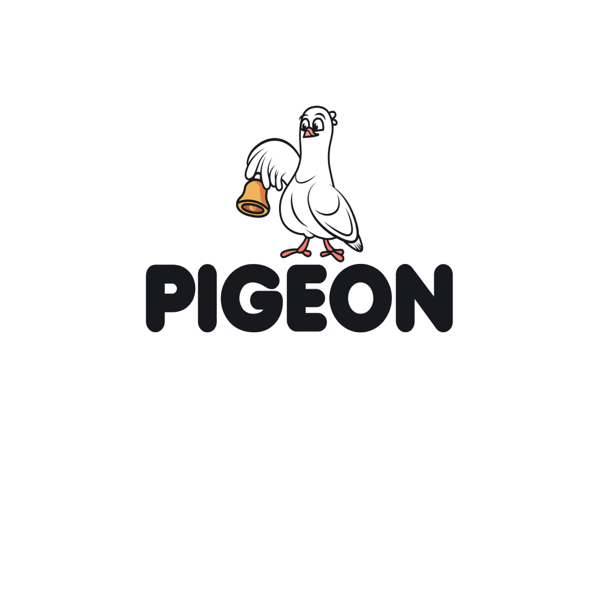

# Pigeon

**Pigeon** is a Flutter-based mobile news application built with clean architecture and Firebase integration. It features modular design with screens for onboarding, authentication, content browsing, bookmarking, and more.

---

## 🌐 Features

* Firebase integration (Firestore, Auth)
* Onboarding screens
* Authentication flow
* News story and content display
* Bookmark and like functionality
* Profile and settings pages
* Search, offline mode, and contact support

---

## 🚀 Getting Started

To get started with this Flutter project:

### Prerequisites

* Flutter SDK
* Dart
* Firebase CLI (optional, for deployment or rules management)

### Installation

```bash
git clone https://github.com/Modexanderson/pigeon.git
cd pigeon
flutter pub get
```

### Firebase Setup

* Add your own `google-services.json` (Android) and `GoogleService-Info.plist` (iOS) to the appropriate platform directories.
* Replace the values in `firebase_options.dart` with your Firebase project configuration (or regenerate it using `flutterfire configure`).

---

## 📂 Project Structure

```
lib/
├── core/               # Core utilities and helpers
├── models/             # Data models
├── screens/            # All UI screens, split by feature
├── widgets/            # Reusable UI components
├── app.dart            # App root config
├── main.dart           # Entry point
```

---

## 📷 Screenshots

Below are some screenshots of the app in action:




> Make sure these images are placed inside the `assets/images` directory and listed in your `pubspec.yaml`:

```yaml
flutter:
  assets:
    - assets/images/
```


---

## ⚙️ Tech Stack

* Flutter
* Firebase (Auth, Firestore)
* Dart

---

## 🛠️ TODO

* [ ] Add unit and widget tests
* [ ] Complete offline mode
* [ ] Add localization (intl/arb)

---

## ✉️ Contact

Created by [Modexanderson](https://github.com/Modexanderson). Feel free to reach out!
